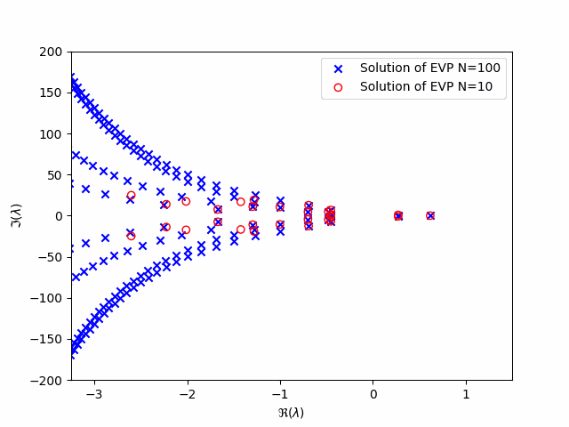

# Time-Delay Systems python package

Adrian loves this animation, I have to put it here as of now


## Getting started

### Prerequisities

### Installation

#### Installing with `pip`

From github
```bash
pip install tdspy@git+https://github.com/LockeErasmus/tdspy
```

Local install
```bash
pip install <path-to-tdspy>
```

#### Installing from source

Clone repository
```bash
git clone https://github.com/LockeErasmus/tdspy.git
```

install from source with `-e` if you are in repository
```bash
pip install -e .
```
or
```bash
pip install -e <path-to-tdspy>
```
otherwise.

## Testing

As of now it is usefull to run tests with visible outputs:
```bash
pytest -rP
```
shows output of passed tests,
```bash
pytest -rx
```
shows output of failed tests (default behaviour of pytest)


## Usage

### Coming from matlab

Original `tds-control` MATLAB package constructed matrices as structure `A={A0, A1, ...}`, it is more computationally efficent to leverage C code (use as much numpy and as little pure python as possible), i.e.

```python
import numpy as np

# matlab-like code
A0 = np.array([[-1, 0, 0, 0],
                [0, 1, 0, 0],
                [0, 0, -10, -4],
                [0, 0, 4, -10]])
A1 = np.array([[3, 3, 3, 3],
            [0, -1.5, 0, 0],
            [0, 0, 3, -5],
            [0, 5, 5, 5]])
A = [A0, A1] # <- list of array
hA = [0, 1] # <-list of number

# better in python
A = np.stack([A0, A1], axis=2) # results is array (4,4,2)
hA = np.array([0., 1])
```

### Examples

Please see the folder ./examples

## Roadmap

High level API (= importable from `tdspy`)
1. `tdspy.RDDE` - class representing Retarded Delay Differential Equation
1. `tdspy.NDDE` - class representing Neutral Delay Differential Equation
1. `tdspy.DDAE`  - class representing Delay Differential Algebraic Equation
1. `tdspy.roots` - computes roots in specified region
1. `tdspy.cd` - computes strong spectral abscissa of associated delay difference equation
1. `tdspy.sa` - computes spectral abscissa
1. `tdspy.strong_sa` - computes strong spectral abscissa MAX(sa, cd)

Submodules
1. `common`
1. `stability`
1. `stabobt`


### tdspy package

```
.
├───src
│   ├───common
│   ├───plot
│   ├───stability
│   └───stabopt
├───examples <- examples for usage
├───docs <- documentation
├───test <- pytest
│
│
├───README.md
├───.gitignore
├───requirements.txt
├───pyproject.toml
└─── ...
```

### Project
- [] `CONTRIBUTING.md` - specify guidelines, ...
- [] `pipy` setup also, register page https://pypi.org/project/tds-control/
- [] add Wim Michiels articles into README
- [] docstrings and sphinx

### Problems
- Compare:
    - `NDDE -> DDAE -> delay-difference equation -> normalize`
    - `NDDE -> delay-difference equation` (already normalized)

## Contributing

Contributions are greatly appriciated. If you have any suggestion that would make this project better, you can:
1. contact me
1. open an issue (with tag `enhancement`)
1. fork the project, make changes and open a pull request

## License

This package is available under [GNU GPLv3 license](./LICENSE).

## Contact

Adam Peichl - adpeichl@gmail.com

## Acknowledgments


